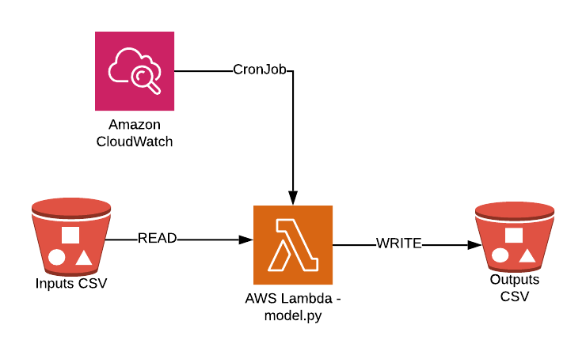

# ml-production-deploy
Deploying Machine Learning models on AWS using Serverless Framework.

In this repository will be preparing the following architecture.



# Details

The input data will be stored in a S3 bucket, in our case the csv file. 

The model file will also be stored inside a S3 bucket. Since the model file can be quite large (>90Mb), we will need to load it during AWS Lambda inference execution from Amazon S3. You can observe that the model downloading was placed outside of the handler function. This was done in order to take advantage of AWS Lambda container reuse. Any code executed outside of the handler method will be invoked only once upon container creation and kept in memory across calls to the same Lambda container, making subsequent calls to Lambda faster.

## Files

- s3_utils.py: functions for read and write from s3
- config.py: load environments variables
- serverless.yml: Serverless Frameworl YML file
- handler.py: file to be invoked for AWS lambda when the service executes the code.
- requirement.txt: python dependencies
- .env: environment variables
- Images/: contains all images from repository
# Usage

Installing Serverless Framework

```
npm install -g serverless
```
In this repository will be using Python3. Create a repository, go inside and run the following command:
```
serverless create --template aws-python3
```

Installing *serverless-python-requirements plugin*. A Serverless v1.x plugin to automatically bundle dependencies from requirements.txt and make them available in your PYTHONPATH.:
```
sls plugin install -n serverless-python-requirements
```
Installing *serverless-dotenv-plugin*. Preload environment variables into serverless. Use this plugin if you have variables stored in a .env file that you want loaded into your serverless yaml config.:
```
npm i -D serverless-dotenv-plugin
```


Deployment
```
serverless deploy
```

## Testing function locally
```
serverless invoke local -f function_name
```